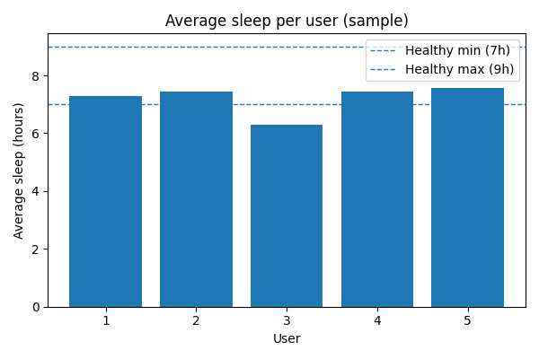

# Sleep Pattern Analyzer 🛌

This is a simple beginner data science project where I try to understand sleep patterns using fake data.  
The idea is: phone logs can tell when people sleep and wake up, so I created a small dataset myself and analyzed it.

---

## Project Structure

sleep-pattern-analyzer/

├── data/

│ └── logs.csv #generated fake data

├── generate_data.py #script to create fake sleep data

├── analyze.py #script to analyze sleep duration

├── plot.py #script to visualize results

└── README.md

---

## 🚀 How to Run

Clone the repo or download the folder.  
Open **Command Prompt** or **PowerShell** inside the project folder.

## Setup (optional but recommended)
Create a virtual environment and install requirements:
python -m venv .venv
.venv\Scripts\Activate.ps1
pip install -r requirements.txt

### Step 1 — Generate fake data
This creates data/logs.csv.

python generate_data.py

### Step 2 — Analyze the data
This reads data/logs.csv and writes outputs/user_sleep_summary.csv.

python analyze.py

### Step 3 — Visualize the results
This saves outputs/sleep_plot.png and shows a bar chart.

python plot.py

### 📊 Example Output

logs.csv → daily sleep logs for a few fake users

user_sleep_summary.csv → each user’s average sleep and health status

Bar chart → compares user sleep with healthy range (7–9 hours)

**Here’s an example of the sleep pattern visualization:**

### 🌱 What I Learned

- How to generate a dataset myself

- Basics of pandas for data analysis

- How to use matplotlib for simple plots

- How to organize a Python project

### 🔮 Future Improvements

- Make the dataset larger and more realistic

- Add clustering (group users by sleep type)

- Create an interactive dashboard

👨‍💻 This is just a beginner-friendly project I made to practice Data Science concepts.

### Created by Jovin Ryan Samuel ✨
